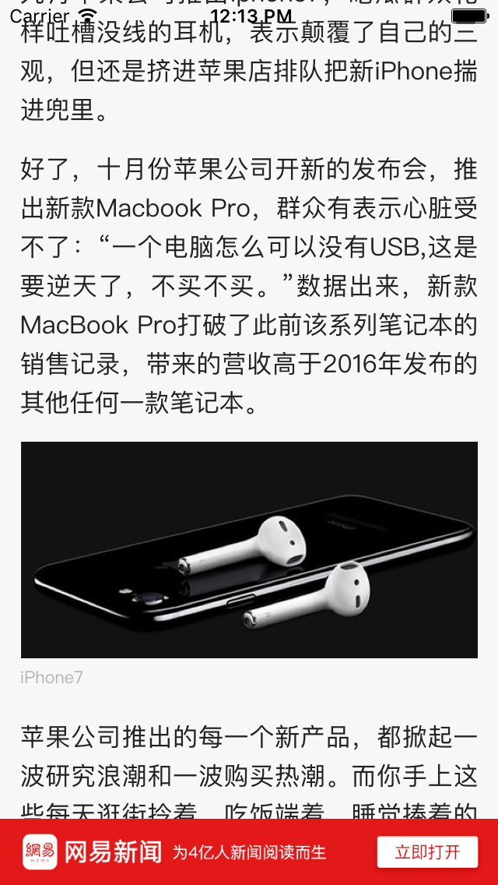

# FilterHtml

##过滤html中的标签,比如img等

demo例子:过滤H5中的img标签,并获取点击的img地址:

###1. 在页面中查找img标签

`

	-(NSArray*)filterImgInHtmlString:(NSString*)htmlContent	{
   		TFHpple *doc = [[TFHpple alloc] initWithHTMLString:htmlContent];
   		NSArray *images = [doc searchWithXPathQuery:@"//img"];
   		NSString *imgUrl = nil;
   		NSMutableArray *imgUrlArray = [NSMutableArray array];
   		for (int i = 0; i < [images count]; i++)
   		{
       		imgUrl = [[images objectAtIndex:i] objectForKey:@"src"];
       		[imgUrlArray addObject:imgUrl];
   		}
   		return imgUrlArray;   
   	 }
`

###2.根据点击事件的坐标获取img标签
`

	-(void)webViewTap:(UIGestureRecognizer*)sender
	{
   	 	CGPoint pt = [sender locationInView:theWebView];
    	NSLog(@"handleSingleTap!pointx:%f,y:%f",pt.x,pt.y);
    
    	NSString *js = [NSString stringWithFormat:@"document.elementFromPoint(%f, 			%f).tagName", pt.x, pt.y];
    	NSString * tagName = [theWebView stringByEvaluatingJavaScriptFromString:js];
    	if ([tagName length] > 0 && [[tagName lowercaseString] isEqualToString:@"img"])
    	{
       	 	NSString *imgURL = [NSString stringWithFormat:@"document.elementFromPoint(%f,%f).src", pt.x, pt.y];
        	NSString *urlYouTap = [theWebView stringByEvaluatingJavaScriptFromString:imgURL];
        	NSLog(@"你点击的图片地址是:%@",urlYouTap);
    	}
    }
`

###3.效果

##你点击的图片地址是:http://cms-bucket.nosdn.127.net/4099de6c779e4dadad7ca85a00182b7920161128173334.png?imageView&thumbnail=690x10000&quality=50

